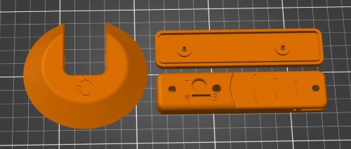

# 3D Print Files
| File                               | Resolution | Infill | Support |
|------------------------------------|------------|--------|---------|
| Light_Proximity_Switch_Base        | 0.2 mm     | 20%    | No      |
| Light_Proximity_Switch_Bottom_Case | 0.2 mm     | 20%    | No      |
| Light_Proximity_Switch_Top_Case    | 0.2 mm     | 20%    | Yes     |

