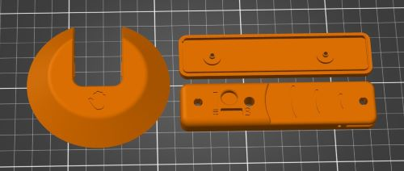

# 3D Print Files
| File                               | Resolution | Infill | Support |
|------------------------------------|------------|--------|---------|
| [Light_Proximity_Switch_Base](/Light_Proximity_Switch_Base.stl)        | 0.2 mm     | 20%    | No      |
| [Light_Proximity_Switch_Bottom_Case](/Light_Proximity_Switch_Bottom_Case.stl) | 0.2 mm     | 20%    | No      |
| [Light_Proximity_Switch_Top_Case](/Light_Proximity_Switch_Top_Case.stl)    | 0.2 mm     | 20%    | No      |

