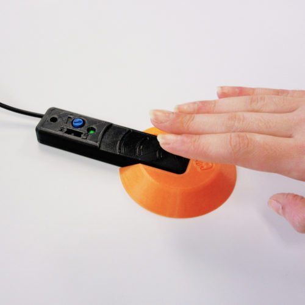
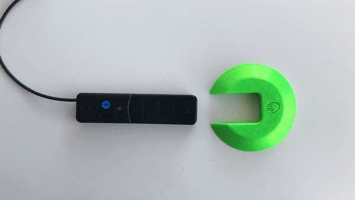

# Light Proximity Switch

> [!IMPORTANT]
2026-Jan-16 Several of the electronic components in this design are no longer available. We are working to determine suitable replacements.

The Light Proximity Switch is an open-source assistive switch that is activated by movement or extremely light contact. It can be activated by waving a hand or limb over the device. This switch has an output cable with a standard 3.5 mm plug and it can be used to control a variety of switch-adapted devices including phones, computers, adapted toys, and gaming consoles.

The Light Proximity Switch is comprised of off-the-shelf electronics, a custom printed circuit board (PCB), and 3D printed parts.

The Light Proximity Switch is open assistive technology (OpenAT). Under the terms of the open source licenses, the device may be built, used, and improved by anyone.

The overall cost of materials for a single build is approximately $35 CAD.

## More info at

- [Makers Making Change Library Page](https://www.makersmakingchange.com/s/product/light-proximity-switch/01tJR0000006942YAA)

## Usage
Plug the 3.5 mm cable from the switch into the device you want to control. Wave a hand or limb over the sensor to trigger the device (the green LED should light up). 

Fine tune the motion sensitivity by toggling the black switch to "HI" or "LO" then fine tuning using the blue dial.

To attach the 3D printed circular base, simply slide the base onto the switch until it clicks into place. This may take a bit of force. The inclined surface of the can make it easier for a user to push their hand up to activate the sensor.

## How to Obtain the Device
### 1. Do-it-Yourself (DIY) or Do-it-Together (DIT)

This is an open-source assistive technology, so anyone is free to build it. All of the files and instructions required to build the device are contained within this repository. Refer to the documentation below.

### 2. Request a build of this device

You may also submit a build request through the [MMC Library Page](https://www.makersmakingchange.com/s/product/light-proximity-switch/01tJR0000006942YAA) to have a volunteer maker build the device. As the requestor, you are responsible for reimbursing the maker for the cost of materials and any shipping.

### 3. Build this device for someone else

If you have the skills and equipment to build this device, and would like to donate your time to create the device for someone who needs it, visit the [MMC Maker Wanted](https://makersmakingchange.com/maker-wanted/) section.

## Build Instructions

### 1. Read through the Documentation

<!--- The [Assembly Guide](/Documentation/Light_Proxity_Switch_Makery_Guide.pdf) contains all the necessary information to build this device, including tool lists, assembly instructions, and testing. --->
Read through the documentation below.

### 2. Order the Custom Printed Circuit Board (PCB)

This device requires a custom PCB. It will need to be ordered from a PCB fabrication service. The Gerber files can be found in the [PCB Build Files](/Build_Files/PCB_Build_Files/). 

### 3. Order the Off-The-Shelf Components

The [Bill of Materials](/Documentation/Light_Proximity_Switch_BOM.csv) lists all of the parts and components required to build the device. This build also requires a custom PCB.

### 4. Print the 3D Printable components

All of the individual print files can be found in the [/Build_Files/3D_Printing_Files](/Build_Files/3D_Printing/) folder.

### 5. Assemble the Light Proximity Switch

Reference the [Assembly Guide](/Documentation/Light_Proxity_Switch_Assembly_Guide.pdf) for the tools and steps required to build each portion.

## How to improve this Device Design
As open assistive technology, you are welcomed and encouraged to improve upon the design. 

## Files
### Documentation
| Document             | Version | Link |
|----------------------|---------|------|
| Design Rationale     | n/a     | WIP   |
| Bill of Materials    | 1.0     |  [Light Proximity Switch BOM](/Documentation/Light_Proximity_Switch_BOM.csv)  |
| Tool List | 1.0 | [Light Proximity Switch Tools List](/Documentation/Light_Proximity_Switch_Tools_List.pdf)|
| Assembly Guide       | 1.0     | [Light Proximity Switch Assembly Guide](/Documentation/Light_Proxity_Switch_Assembly_Guide.pdf) |
| QC Quide | 1.0 | [Light Proximity Switch QC Guide](/Documentation/Light_Proximity_Switch_QC_Guide.pdf)|
| Troubleshooting Guide | 1.0 | [Light Proximity Switch Troubleshooting Guide](/Documentation/Light_Proximity_Switch_Troubleshooting_Guide.pdf)|
| Delivery Checklist | 1.0 | [Light Proximity Delivery Checklist](/Documentation/Light_Proximity_Switch_Delivery_Checklist.pdf)|
| User Guide           | 1.0     | [Light Proximity Switch User Guide](/Documentation/Light_Proximity_Switch_User_Guide.pdf) |
| Changelog            | n/a     | -     |

### Design Files
<!---
DESIGN FILES
--->
 - [CAD Files](/Design_Files/CAD_Design_Files)
 - [PCB Design Files](/Design_Files/PCB_Design_Files/)

### Build Files
 - [3D Printing Files](/Build_Files/3D_Printing_Files)
 - [PCB Build Files](/Build_Files/PCB_Build_Files)

## License
Copyright (c) 2019-2026 Neil Squire / Makers Making Change.

This repository describes Open Hardware:
 - Everything needed or used to design, make, test, or prepare the Light Proximity Switch is licensed under the [CERN 2.0 Weakly Reciprocal license (CERN-OHL-W v2) or later](https://cern.ch/cern-ohl ) .
 - Accompanying material such as instruction manuals, videos, and other copyrightable works that are useful but not necessary to design, make, test, or prepare the Light Proximity Switch are published under a [Creative Commons Attribution-ShareAlike 4.0 license (CC BY-SA 4.0)](https://creativecommons.org/licenses/by-sa/4.0/) .

You may redistribute and modify this documentation and make products using it under the terms of the [CERN-OHL-W v2](https://cern.ch/cern-ohl).
This documentation is distributed WITHOUT ANY EXPRESS OR IMPLIED WARRANTY, INCLUDING OF MERCHANTABILITY, SATISFACTORY QUALITY AND FITNESS FOR A PARTICULAR PURPOSE.
Please see the CERN-OHL-W v2 for applicable conditions.

Source Location: https://github.com/makersmakingchange/Light-Proximity-Switch

## Attribution
The Light Proximity Switch is an original design by Neil Squire / Maker Making Change Program.

### Contributors
  - Derrick Andrews, Neil Squire Society / Makers Making Change.
  - Jake McIvor, Neil Squire Society / Makers Making Change.
  - Kristina Mok, Neil Squire Society / Makers Making Change.

<!-- ABOUT MMC START -->
## About Makers Making Change

Makers Making Change is a program of [Neil Squire](https://www.neilsquire.ca/), a Canadian non-profit that uses technology, knowledge, and passion to empower people with disabilities.

Makers Making Change leverages the capacity of community based Makers, Disability Professionals and Volunteers to develop and deliver affordable Open Source Assistive Technologies.

 - Website: [www.MakersMakingChange.com](https://www.makersmakingchange.com/)
 - GitHub: [makersmakingchange](https://github.com/makersmakingchange)
 - Bluesky: [@makersmakingchange.bsky.social](https://bsky.app/profile/makersmakingchange.bsky.social)
 - Instagram: [@makersmakingchange](https://www.instagram.com/makersmakingchange)
 - Facebook: [makersmakechange](https://www.facebook.com/makersmakechange)
 - LinkedIn: [Neil Squire Society](https://www.linkedin.com/company/neil-squire-society/)
 - Thingiverse: [makersmakingchange](https://www.thingiverse.com/makersmakingchange/about)
 - Printables: [MakersMakingChange](https://www.printables.com/@MakersMakingChange)

### Contact Us
For technical questions, to get involved, or to share your experience we encourage you to [visit our website](https://www.makersmakingchange.com/) or [contact us](https://www.makersmakingchange.com/s/contact).
<!-- ABOUT MMC END -->
